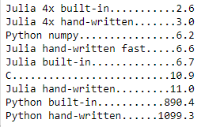

### 1. @spawnat will return a `Future` type
```
r = @spawnat 2 rand()
```
#>>Future(2, 1, 14, nothing)

Use `fetch()` to get the value.

### 2.DistributedArrays
This combines the memory resources of multiple machines, allowing use of arrays too large to fit on one machine  
Each process can read and write to the part of the array it owns and has read-only access to the parts it doesn't own

### 3. Multi-core is faster
Background:
```
using Distributed
using DistributedArrays
addprocs(4)
@everywhere using DistributedArrays

a = rand(10^7)
adist = distribute(a) #10000000-element DArray{Float64,1,Array{Float64,1}}
```

The hand-written parallel function:

```
function mysum_dist(a::DArray)
    r = Array{Future}(undef, length(procs(a)))  #because @spawnat will return Future
    for (i, id) in enumerate(procs(a))
        r[i] = @spawnat id sum(localpart(a))
    end
    return sum(fetch.(r))
end
```
Note, the `localpart(adist)` will return empty array, because it's distributed in each cores.  
The reason why this is fast is because @spawnat only assigns jobs, so the for-loop takes no time.


The built-in parallel function:

```
sum($adist)
```

### 4. Time comparison:



### 5. @spawnat only assign jobs.
0s:
```
@btime for i in 2:5
    r = @spawnat i sum(randn(100000000))
end
```
#>> 50.200 μs (122 allocations: 5.59 KiB)  

### 6. fetch() only collelc result  
No matter we fetch() the result, each core will do its calculation once we use @spawnat to assign calculation. But it makes no sense since we always want to know the result


